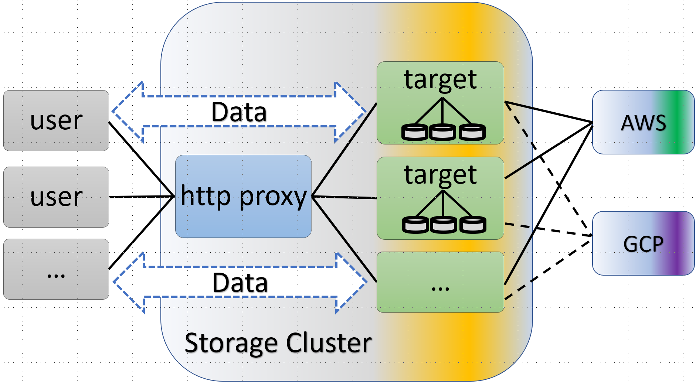

DFC: Distributed File Cache (DFC) with Amazon and Google Cloud backends


## Overview

DFC is a simple distributed caching service written in Go. The service
currently consists of a single http proxy (with a well-known address)
and an arbitrary number of storage targets (aka targets):



Users (http/https clients) connect to the proxy and execute RESTful commands.
Data then moves directly between the target that has it and the requesting user.

## Getting Started

If you've already installed Go and happen to have AWS or GCP account, getting 
started with DFC takes about 30 seconds and consists in executing the following
4 steps:

```
$ go get -u -v github.com/NVIDIA/dfcpub/dfc 
$ cd $GOPATH/src/github.com/NVIDIA/dfcpub/dfc
$ make deploy
$ go test -v -run=down -numfiles=2 -bucket=<your bucket name>
```

The 1st command will install both the DFC source code and all its dependencies 
under your configured $GOPATH.

The 3rd - deploys DFC daemons locally (for details, please see [the script](dfc/setup/deploy.sh)).

Finally, the 4th command executes a smoke test to download 2 (two) files
from your own Amazon or Google bucket.

For more testing/running command line options, please refer to [the source](dfc/main_test.go).

For other useful commands, see the [Makefile](dfc/Makefile).
