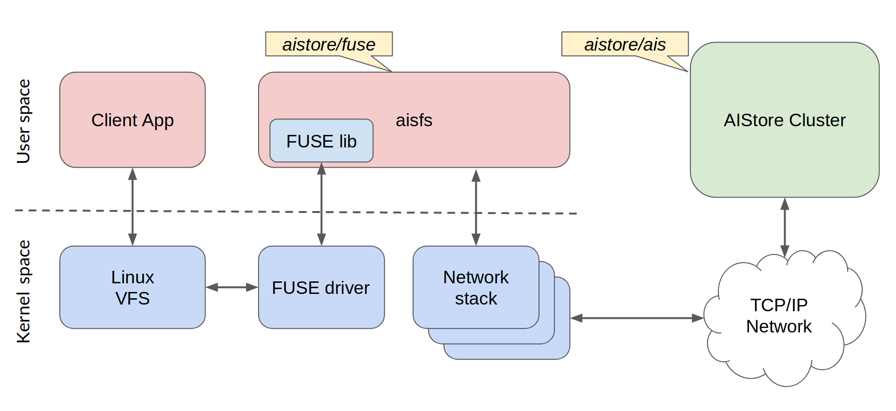

# AISFS: a FUSE client for AIStore

## Table of Contents

- [Background](#background)
- [High-level architecture](#high-level-architecture)
- [Prerequisites](#prerequisites)
- [Getting Started](#getting-started)
  - [Installation](#installation)
  - [Quick Local Setup](#quick-local-setup)
  - [Mounting](#mounting)
  - [Unmounting](#unmounting)

## Background

FUSE (Filesystem in Userspace) is an interface in Linux and other Unix-like
operating systems that enables user space programs to export a filesystem
to the kernel. FUSE consists of a kernel module `fuse.ko`, a user space library
and a mount utility `fusermount`. There are currently over 100 FUSE filesystems
available on the Web - the fact that can likely be attributed to popularity
of the file (aka POSIX) access to storage on the one hand, and ease of
development and maintenance of the filesystem in userspace (as opposed to
kernel), on the other.

Generally, storage-backend-specific FUSE client provides a convenient
(albeit not necessarily fast) way to access and interact with a storage service.
Notable examples include
[s3fs](https://github.com/s3fs-fuse/s3fs-fuse) for Amazon S3 and
[gcsfuse](https://github.com/GoogleCloudPlatform/gcsfuse) for Google Cloud
Storage. The original motivation behind FUSE client for AIStore was the same:
provide a familiar filesystem interface for interactive work with AIStore buckets
and objects as well as native integration with Linux tools, libraries
and frameworks.

## High-level architecture

AISFS enables a non-privileged user to mount a single AIStore bucket
(one bucket per mount) in an empty directory on a local filesystem and access
objects as if they were regular files. System calls (such as file open, read, write
etc.) from applications are routed through the VFS layer to the Linux FUSE driver,
which in turn invokes the corresponding AISFS instance responsible for POSIX to
REST API mapping of the request. A communication diagram is shown in the figure
below.



> Clearly, there is a lot of data transfer involved between kernel space and user
space. This "up-and-down" communication between the kernel and user processes
is causing significant overhead, a performance weak spot for FUSE filesystems
in general. One of the main goals of FUSE client for AIStore is to give as good
performance as possible by reducing the effect of mentioned overhead.

## Prerequisites

* Linux
* `fuse.ko` FUSE kernel module
* `fusermount` mount CLI utility
* [Go 1.13](https://golang.org/dl/) or later
* Running [AIStore](../README.md) cluster

Depending on your Linux distribution, you may or may not already have `fuse.ko`
and `fusermount` installed on your system. If you are using Ubuntu 18.04 LTS,
you can verify this by running the following commands (expect similar output to
the one shown below):

```shell
$ grep -i fuse /lib/modules/$(uname -r)/modules.builtin
kernel/fs/fuse/fuse.ko
$ fusermount -V
fusermount version: 2.9.7
```

## Getting Started

### Installation

In order to install `aisfs` on your system, execute the following commands:

```shell
$ cd $GOPATH/src/github.com/NVIDIA/aistore/fuse
$ ./install.sh
```

Verify that `aisfs` has been successfully installed:

```shell
$ aisfs -v
aisfs version 0.2 (build d9882586)
```

View help and usage information by running:

```shell
$ aisfs --help
```

### Quick Local Setup

In order to quickly set up and try `aisfs` on your local machine, first
deploy an AIStore cluster (for more info see AIStore [README](../README.md)):

```shell
$ cd $GOPATH/src/github.com/NVIDIA/aistore/ais
$ make deploy
```

Using [AIS CLI](../cli/README.md) create an ais bucket, download several objects
and place them into the bucket:

```shell
$ ais create bucket mybucket
$ ais start download "gs://lpr-vision/imagenet/imagenet_train-{000000..000010}.tgz" ais://mybucket/
Ys78ND09g
$ ais show download Ys78ND09g --progress # wait for download to finish
```

Create an empty directory in your local filesystem:

```shell
$ cd $HOME
$ mkdir localdir
```

Finally, mount a filesystem and run a filesystem server as a daemon using
the following command:

```shell
$ aisfs mybucket localdir/
```

List objects in the bucket:

```shell
$ ls localdir/
```

Unmount the file system and remove previously created local directory:

```shell
$ fusermount -u localdir/
$ rmdir localdir
```

### Mounting

It is not necessary to use a separate utility in order to mount a filesystem,
`aisfs` it is both a filesystem server and a mount utility.

Assuming `mybucket` is a bucket name, `localdir` is an empty directory
in your local filesystem and an instance of AIStore cluster is running
on the local machine, the following command will mount `mybucket`
in `localdir`, making `localdir` the root directory of `aisfs`:

```shell
$ aisfs mybucket localdir/
```

Filesystem is, by default, serviced by the user space background process (daemon),
that will continue to run until the filesystem is unmounted.
To run the filesystem server in the foreground, pass the `--wait ` option to
`aisfs`:

```shell
$ aisfs --wait mybucket localdir/
```

Although `aisfs` will attempt to discover an AIStore cluster on the local
machine, it is possible to explicitly provide proxy's URL as a command-line
`--url` option:

```shell
$ aisfs --url 'http://127.0.0.1:8080' mybucket localdir/
```

### Unmounting

There are three methods for unmounting the AISFS filesystem and stopping
the AISFS user space daemon:

1. Use the `fusermount` utility. The `-u` option requests unmounting:

   ```shell
   $ fusermount -u localdir/
   ```

2. Use the `umount` command:

   ```shell
   $ umount localdir/
   ```

   >  You may need root privileges to execute this command.

3. If `aisfs` is invoked in the foreground by passing the `--wait` option,
   simply interrupting the process by pressing Ctrl-C. This will also
   unmount the filesystem.